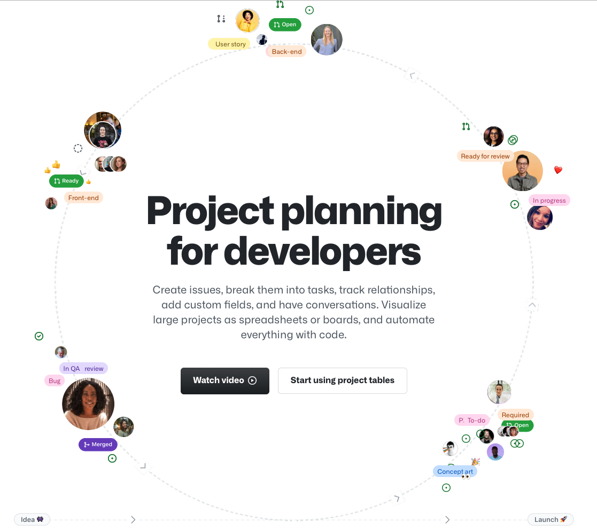

# Contributing to Chits Picker

* [Code of Conduct](#code-of-conduct)
* [Issues](#issues)
* [Pull Request](#pull-requests)
* [Developer's Certificate of Origin 1.1](#developers-certificate-of-origin)

## Code of Conduct

This code describes the *minimum* behaviour expecations for all contributors.

Open, diverse, and icnlusive communities live and die on the basis of trust. Contributors can disagree with one another so long as they trust that those disagreements are in good faith and everyone is working towards a common goal.

### Our Pledge

We as members, contributors, and leaders pledge to make participation in our community a harassment-free experience for everyone, regardless of age, body size, visible or invisible disability, ethnicity, sex characteristics, gender identity and expression, level of experience, education, socio-economic status, nationality, personal appearance, race, religion, or sexual identity and orientation.

We pledge to act and interact in ways that contribute to an open, welcoming, diverse, inclusive, and healthy community.

Please see the [GitHub Community Guidelines](https://docs.github.com/en/github/site-policy/github-community-guidelines).

## Issues

Please see [GitHub Issues](https://github.com/features/issues/) for more information

## Pull Requests

> #### About pull requests
>
> Pull requests let you tell others about changes you've pushed to a branch in a repository on GitHub. Once a pull request is opened, you can discuss and review the potential changes with collaborators and add follow-up commits before your changes are merged into the base branch.

Please see the [About pull requests](https://docs.github.com/en/pull-requests/collaborating-with-pull-requests/proposing-changes-to-your-work-with-pull-requests/about-pull-requests) for more information.

## Developer's Certificate of Origin 1.1

<pre>
By making a contribution to this project, I certify that:

 (a) The contribution was created in whole or in part by me and I
     have the right to submit it under the open source license
     indicated in the file; or

 (b) The contribution is based upon previous work that, to the best
     of my knowledge, is covered under an appropriate open source
     license and I have the right under that license to submit that
     work with modifications, whether created in whole or in part
     by me, under the same open source license (unless I am
     permitted to submit under a different license), as indicated
     in the file; or

 (c) The contribution was provided directly to me by some other
     person who certified (a), (b) or (c) and I have not modified
     it.

 (d) I understand and agree that this project and the contribution
     are public and that a record of the contribution (including all
     personal information I submit with it, including my sign-off) is
     maintained indefinitely and may be redistributed consistent with
     this project or the open source license(s) involved.
</pre>
