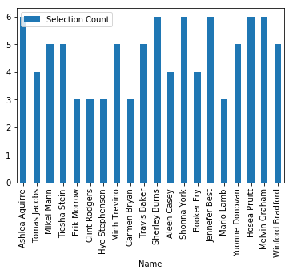
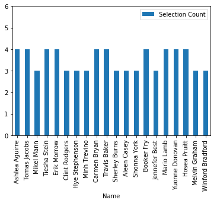

# Chit Picker 

## Background

Chits Picker is an open-source web-based application that allows instructors to (as fairly as possible) select cohort members to address questions without taking into account the difficulty rating of problems during the selection process.

It is effectively a a random name selector with a _weighted_ probabilities to select a name from a list. The weighting is designed to simulate the nominal uniform distribution when a histogram of all picked names are plotted.

## Featuring

**A simple list of features are:**

* Ability to pick a name from a list of names with uniform probably
* To keep the selection fair, track total "picks" of a specific name and use that number of weight down the probability of selecting that name in the future
* Keep track of picks across multiple sessions
* Barchart of picks so that the fairness can be monitored

#### Example

This sort of distribution is unbalanced (_with a range_ of 3), indicating that some members of the cohort are being selected more often than others.

While this distribution is a little bit more uniform (_with a range of_ 1).

